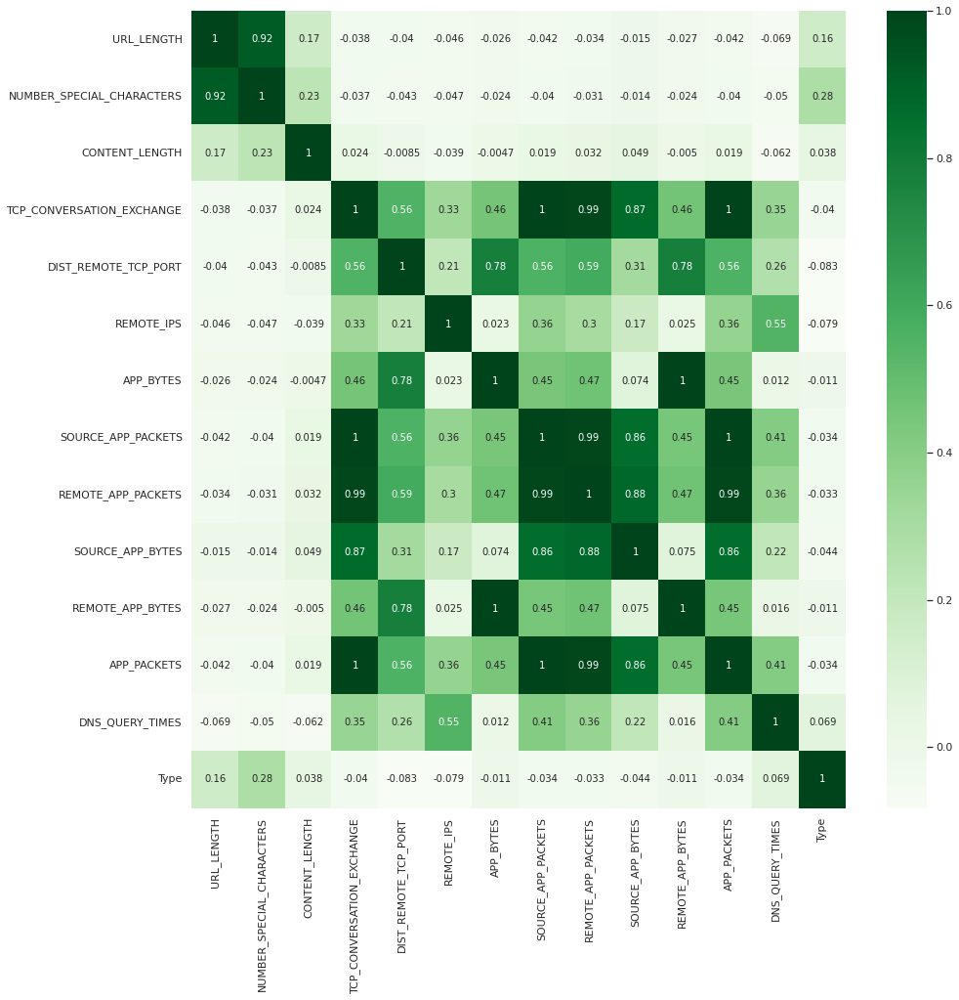

# __Classification des sites web malveillants et sécurisés__

## __Introduction__

Les services informatiques déstinées à l'usage publique sont généralement exploitable à travers des sites web. 

De ce fait, les utilisateurs se trouvent souvent dans des sites web malveillants qui ont pour but dans le plus fréquent des cas de collecter des données utilisateurs.

De nos jours, la cybersécurité et l'infosec fait appel à des techniques du ML pour augmenter la sécurité, et dans ce qui suit j'expliquerai comment implémenter un classifieur de sites web selon la malveillance.

## __Approche générale__
> *Remarque : le dataset utilisé se trouve [ici](https://drive.google.com/file/d/16ZoWefXlM386ZaxDtPkotzHVBE169oOh/view?usp=sharing)*

Dans un premier temps on se pose les questions suivantes :

- Est-ce que la localisation géographique du site web (pays) permet de donner d'information sur sa malveillance ? 
- Comment les données dont corrélées entre-elles ?
- Quel est l'élément principal dans la description du comportement global d'un site web ?

## __Analyser les données__
C'est la partie la plus importante dans tout le processus d'implémentation qui nous permettera de savoir si les données sont structurées, semi-structurées ou non-structurées, y a t'il des valeurs manquantes, y a t'il un bruit (noisy data) ou pas.

## __Préparation des données__
En comprenant le sense des données, on s'apperçoit clairement qu'il y a du bruit.

Par exemple, la colonne CHARSET a des valeurs en majiscule mais d'autres en miniscule, donc déjà faut convertir le tout en majiscule.

De meme, la colonne WHOIS_COUNTRY a le meme problème, et il y a aussi des valeurs manquantes d'où la nécéssité d'une interpolation.

Ensuite, on peut répondre à la question clé de cette analyse :
> Quelles sont les colonnes (variables) qui sont les plus représentatives et influentes ? 

Une façon de répondre à celà consiste à calculer la matrice de corrélation.

> Constat : les colonnes URL_LENGTH, NUMBER_SPECIAL_CHARACTERS, DNS_QUERY_TIMES ont la plus grande corrélation avec la colonne TYPE.

> Conclusion : l'entrainement doit se faire sur ces propriétés, car c'est les paramètres les plus influents sur le type du site web.

## __Modélisation et résultats__
J'ai utilisé deux approches différentes pour la classification :
> - Random forest 
> - K-Nearest Neighbors avec k = 4

J'ai eu une meilleure précision avec la première méthode, ceci peut etre expliqué comme suit : 

- Cet algorithme peut prendre en charge des données dans un espace de dimension large
- Un bon estimateur pour les valeurs manquantes

